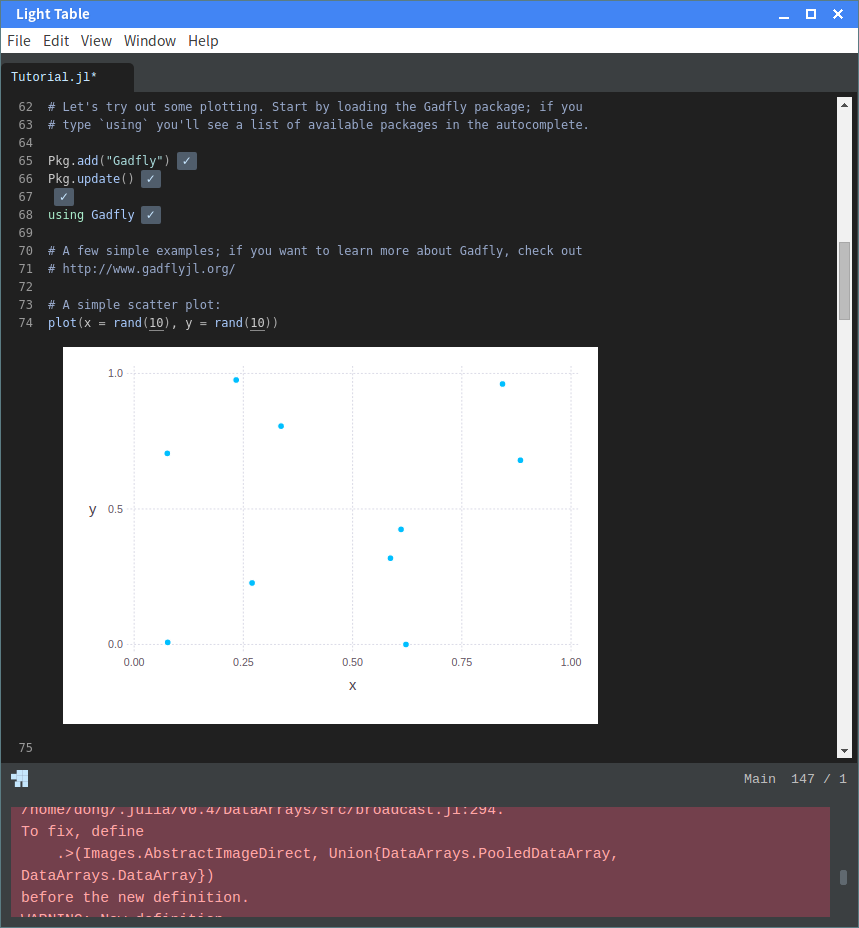
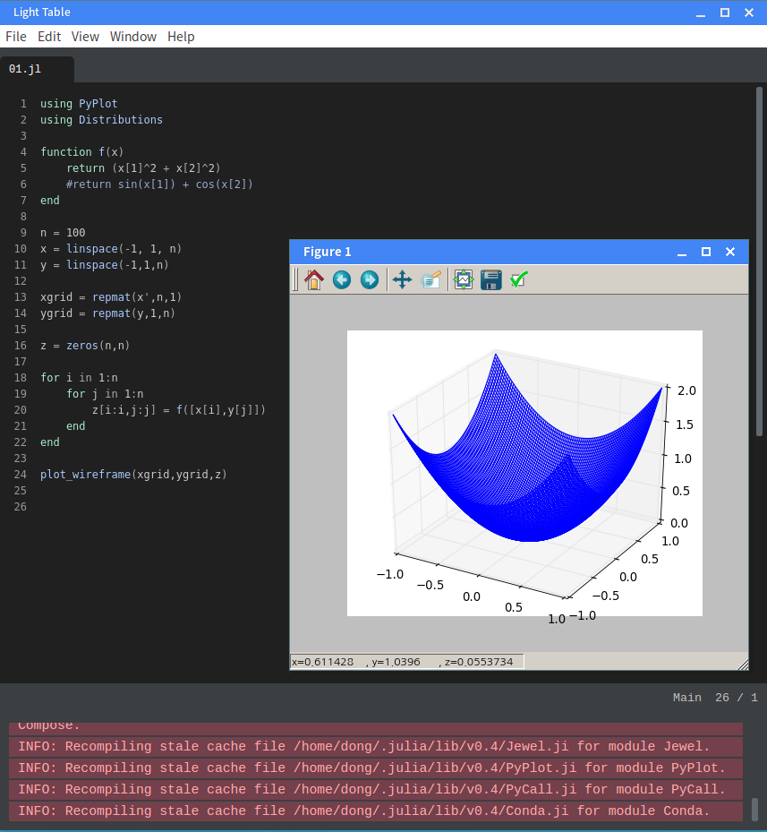
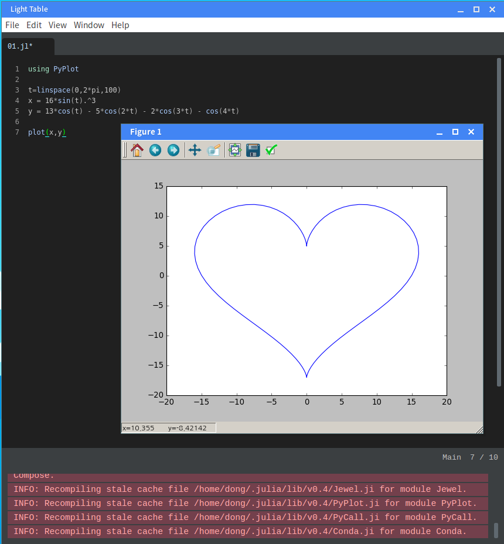

# 4교시 : Light Table 에디터 설치해서 간단히 사용해 보기


## 4.1. Text Editor

* Jupyter가 있긴 하지만, 그래도 강력한 텍스트 에디터 하나쯤은 있는 것이 좋겠다.
* 현재의
시스템에서는 다음 에디터들이 이미 설치되어 있다.

> GUI용으로는 l3afpad 에디터.  윈도우 메모장 정도의 간단한 것.

>
터미널용으로는 vim 에디터.  유닉스 계열 운영체제에는 거의 100% 설치되어 있는 일종의 표준.

* IDE 급의 강력한 에디터 중에서 최신
트랜드를 주도하는 것들은 다음과 같은 것들이 있다.

> Github Atom : https://atom.io/

> Microsoft
Visual Studio Code : https://code.visualstudio.com/

> Sublime Text :
https://www.sublimetext.com/

> Brackets : http://brackets.io/

> Light Table :
http://lighttable.com/

## 4.2. LightTable

* 최신기술들을 모험적으로 적용 (해커 기질 발동)

> 웹기술을 극단적으로 철저하게 적용 (요즘 트랜드인
듯)

> Clojure 언어로 개발 (Lisp 계열 함수형 언어 중에서 제일 최신 변종)

> 자체 패키지 관리자 내장 (플러그인 추가 및
관리 용이)

> Julia 언어의 기본 편집기로 지정

> 자본력이 없는 후발 벤쳐업체 (킥스타터 크라우드 펀딩으로 시작함)가 거대기업들과
경쟁중

* 첫인상은 굉장히 단순해 보이지만, 까보면 엄청난 것이 숨어있다는 느낌을 줌.
* LightTable개발 계기가 된 신형 텍스트
에디터에 관한 강연 : https://vimeo.com/36579366

## 4.3. LightTable 설치

* 최신버전을 제공해 주는 저장소를 추가하고 APT로 설치하는 것이 가장 유리함
```
sudo
add-apt-repository ppa:dr-akulavich/lighttable
sudo apt-get update
sudo apt-get
install lighttable-installer
```
* 사용 설명서 : http://docs.lighttable.com/

## 4.4. LightTable에 Julia 관련 플러그인 설치

* `Ctrl+Space`를 눌러보자.
* `plugin`을 검색해 보자.
* 플러그인 관리 메뉴를 선택한 후, 팝업이 뜨면 다음 플러그인을 설치해 주면 된다.

> Juno, Juniper, Julia

* Juno는
LightTable 안에서 Julia와 관련된 환경을 셋팅해 주는 플러그인이다.
* 이제 LightTable을 종료했다가 다시 실행시키면 된다.
* LightTable 실행시에 뒷단에서 Julia를 실행시켜 연결하고 환경이 구성된다.

## 4.5. LightTable에 Markdown 플러그인 설치

* 플러그인 관리 메뉴에서, Markdown을 찾아서 설치해 주면 된다.
*
실행 방법은, `Ctrl+Space`해서 `Commands`를 연 다음에 `Markdown: watch this editor for
changes`를 선택한다.
* 랜더링 화면은 편집하면 실시간으로 반영된다.

## 4.6. LightTable 환경설정 조정해 보기


* `Commands`에서 `Settings: User behaviors`을
선택하면, 설정용 파일이 열린다.
* 여기에 다음 내용을 추가해 본다. (폰트, 사이즈, 줄간격 설정)
```
;; 폰트 수정 추가
[:editor :lt.objs.style/font-settings "Noto Sans Mono CJK kr" "11" "1.2"]
```

*
그리고 변경된 상태를 확인.

## 4.7. LightTable Juno 환경에서 Julia 코딩 작업해 보기

* `파일이름.jl`로 파일을 하나 만들고, 거기에 Julia
코드를 넣고 실행하는 방식이다.
* 다음 코드를 복사해서 넣어보자.
```
```

### LightTable 작업 환경

* Gadfly 같은 패키지를 이용하면 에디터 내에서 직접 그래프가 그려지기 때문에 Jupyter
Notebook 같은 느낌을 가지고도 작업 가능하다.



### PyPlot으로 3D 그래프 플랏

```python
using PyPlot
using Distributions

function f(x)
    return (x[1]^2 + x[2]^2)
    #return sin(x[1]) + cos(x[2])
end

n = 100
x = linspace(-1, 1, n)
y = linspace(-1,1,n)

xgrid = repmat(x',n,1)
ygrid = repmat(y,1,n)

z = zeros(n,n)

for i in 1:n
    for j in 1:n
        z[i:i,j:j] = f([x[i],y[j]])
    end
end

plot_wireframe(xgrid,ygrid,z)
```

* PyPlot은 MatPlotLib를 그대로 가져다 Julia에서 쓰는 것이므로, LightTable과 완전히 통합되어 있지 못하다.
*
따라서 아래 그림과 같이, 그래프는 별도 팝업창에 뜬다.


```python
using PyPlot

t=linspace(0,2*pi,100)
x = 16*sin(t).^3
y = 13*cos(t) - 5*cos(2*t) - 2*cos(3*t) - cos(4*t)

plot(x,y)
```


